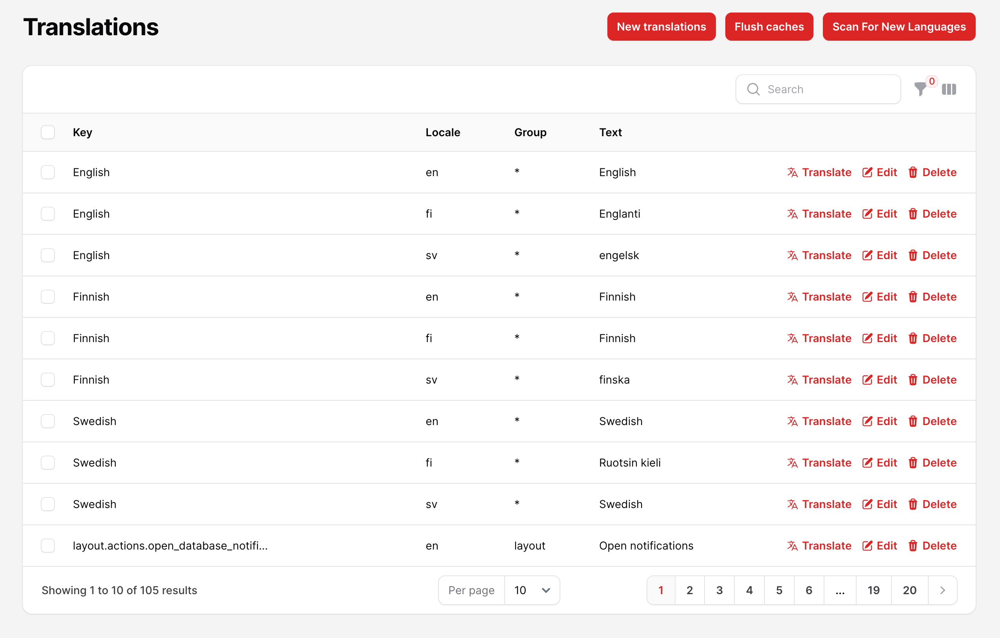
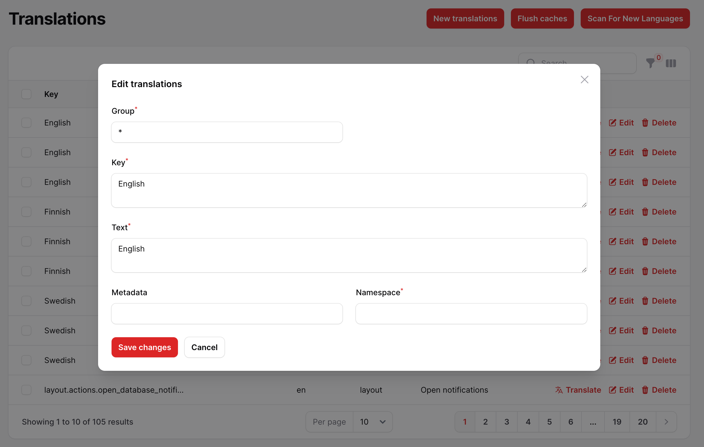

# Filament Translations

Manage your translation with DB and cache, you can scan your languages tags like `trans()`, `__()`, and get the string inside and translate them use UI.

this plugin is build in [spatie/laravel-translation-loader](https://github.com/spatie/laravel-translation-loader)

## Screenshots






## Installation

You can install the package via composer:

```bash
composer require 3x1io/filament-translations
```

Run migration:

```bash
php artisan vendor:publish --tag="filament-translations"
php artisan vendor:publish --tag="filament-translations-config"
php artisan migrate
```

In `config/app.php` (Laravel) or `bootstrap/app.php` (Lumen) you should replace Laravel's translation service provider 
if you have one, or if you don't, just add the following service provider aliases:

```php
'translator' => \Spatie\TranslationLoader\TranslationServiceProvider::class,
'translation.loader' => \Spatie\TranslationLoader\TranslationServiceProvider::class,
```


```php
Illuminate\Translation\TranslationServiceProvider::class,
```

by the one included in this package:

```php
Spatie\TranslationLoader\TranslationServiceProvider::class,
```

## Add Language Middleware

go to app/Http/Kernel.php and add new middleware to $middlewareGroups

```php
    'web' => [
        //...
        \io3x1\FilamentTranslations\Http\Middleware\LanguageMiddleware::class,
    ],
```

go to config/filament.php and add middleware to middleware auth array

```php
    'middleware' => [
        'auth' => [
            //...
            \io3x1\FilamentTranslations\Http\Middleware\LanguageMiddleware::class
        ],
        //...
    ];
```

and now clear cache

```bash
php artisan optimize:clear
```

To add the translations UI to your panel, add it to the `resources` method of your panel:
```php
    public function panel(Panel $panel): Panel
    {
        return $panel
            ->resources([
                \io3x1\FilamentTranslations\Resources\TranslationResource::class,
            ])
```


## Changelog

Please see [CHANGELOG](CHANGELOG.md) for more information on what has changed recently.

## Credits

-   [Fady Mondy](https://github.com/3x1io)

## License

The MIT License (MIT). Please see [License File](LICENSE.md) for more information.
